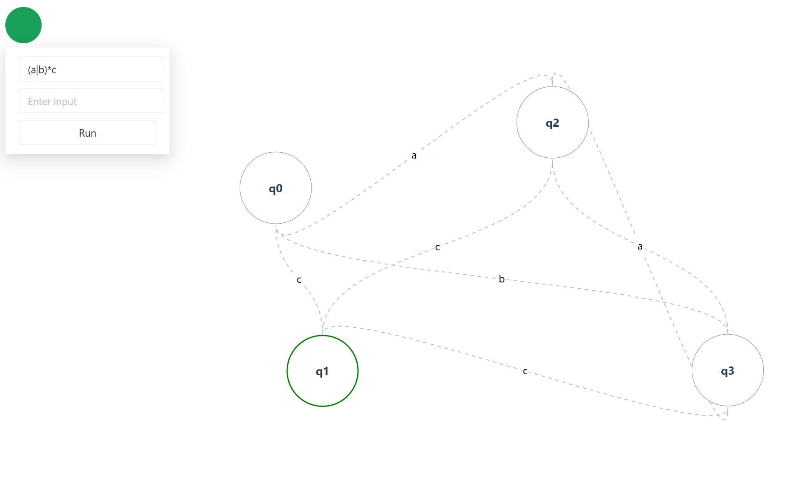

 # DFA visualize

## Introduction

In this project, we implemented a simple regular expression parser, which takes a regex string (only contains a-z, A-Z) and form a visualized DFA base on it.

## Workflow

Firstly, we convert the regex input into AST, then convert AST to NFA, and finally to DFA
